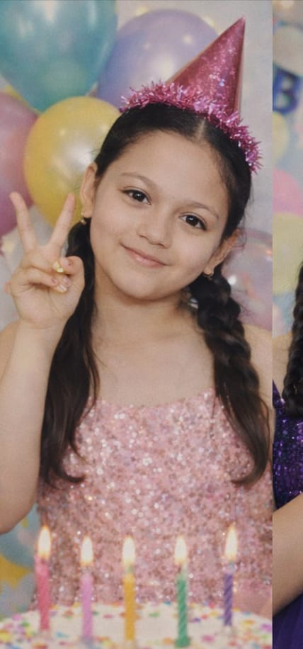

<!DOCTYPE html>
<html lang="en">
<head>
<meta charset="UTF-8">
<meta name="viewport" content="width=device-width, initial-scale=1.0">
<title>Nirmala’s BTS Birthday 💜🎂</title>

</head>
<body>

<canvas id="fireworks"></canvas>

  <h1>🎂 Countdown to Nirmala’s Birthday 🎂💜</h1>
  

    
00<small>Days</small>

    
00<small>Hours</small>

    
00<small>Minutes</small>

    
00<small>Seconds</small>

  

  
Keep shining like BTS, smiling like Jimin, and spreading love like ARMY 💜🎶

  <button id="playMusicCountdown">🔊 Play Countdown Music</button>

  <h1>💜 Happy Birthday, Nirmala! 🎂✨</h1>
  
  <h2>Shine Bright Like BTS 💫🎶</h2>
  
Dear Nirmala, today is your special day! 🌟 
     May your smile light up the world, your dreams come true, 
     and your days be as joyful as your favorite BTS songs.

  
🎁 Your Special Gift: A token of love 💜

  
Keep shining, dancing, and smiling like only you can. Happy Birthday 💖🎶

  <button id="playMusicBirthday">🔊 Play Birthday Music</button>

<!-- Music files -->
<audio id="musicCountdown" loop>
  <source src="Liquid Time-Aakash Gandhi (mp3cut.net).mp3" type="audio/mp3">
</audio>
<audio id="musicBirthday" loop>
  <source src="micro.mp3" type="audio/mp3">
</audio>

</body>
</html>
